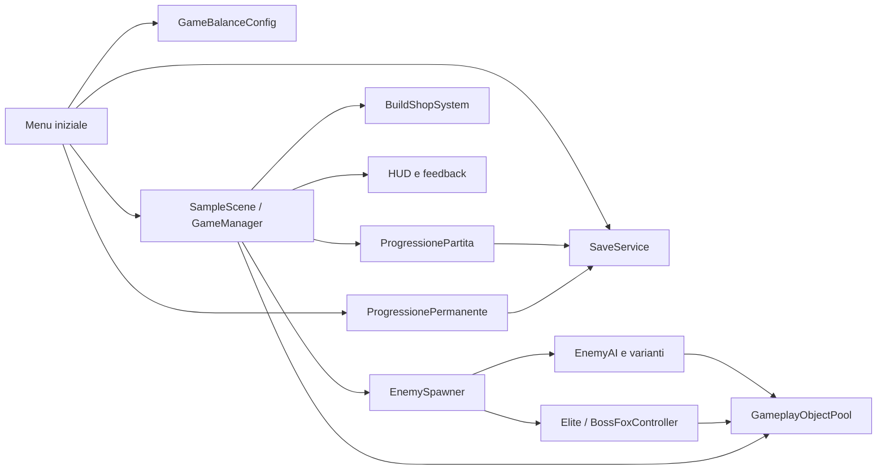
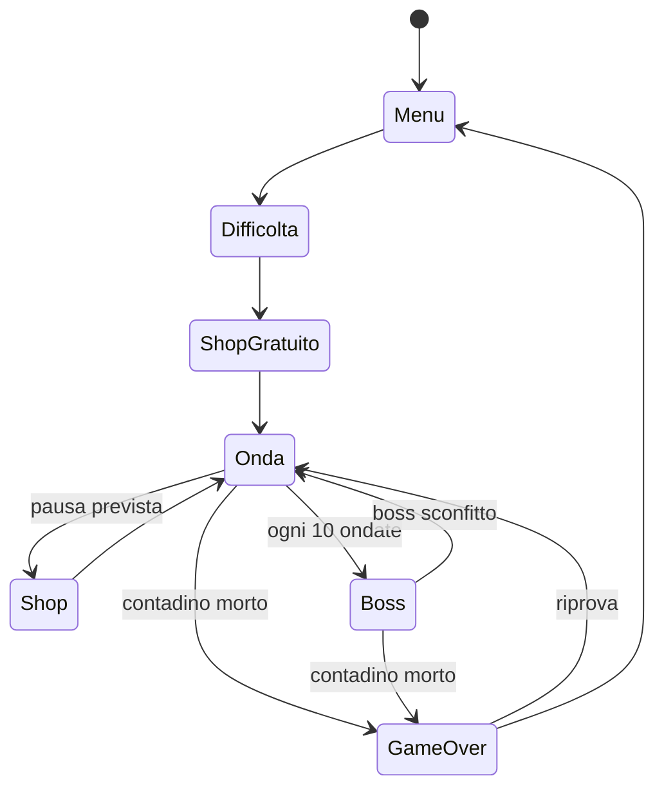

# Architettura del progetto

## Vista generale

## Responsabilità

| Area | Componenti principali | Responsabilità |
|---|---|---|
| Flusso | `MenuInizialeController`, `GameManager` | ingresso, partita, pausa, morte e ritorno al menu |
| Bilanciamento | `GameBalanceConfig` | unica fonte dei valori runtime normalizzati |
| Onde | `WaveChapterDirector`, `EnemySpawner` | capitoli infiniti, budget, composizione e spawn attorno al giocatore |
| Nemici | `EnemyAI`, `FoxVariants`, abilità dedicate | movimento comune, statistiche e comportamenti distinti |
| Incontri | `SpecialEncounterDirector`, `BossFoxController` | élite, boss, fasi, ricompense e attacchi telegrafati |
| Build | `BuildShopSystem`, `ShopInterOndata` | offerte, archetipi, sinergie ed evoluzioni |
| Meta | `ProgressionePermanente`, `ShopPermanentePrePartita` | gettoni e potenziamenti tra le partite |
| Persistenza | `SaveService`, `SaveData` | JSON versionati, backup, migrazione e separazione profilo/dispositivo |
| Prestazioni | `GameplayObjectPool`, `HighWaveStability` | riuso degli oggetti e limiti di sicurezza nelle ondate alte |
| Input | `FarmerInputController` | tastiera, mouse, gamepad, UI e rimappatura |
| Presentazione | `FarmPixelUI`, HUD e feedback | stile coerente, icone, audio e leggibilità del combattimento |

## Flusso di una partita

## Confini dei dati

`GameBalanceConfig` contiene valori di design e non progressi del giocatore.
`SaveData` contiene il profilo trasportabile: record e progressione permanente.
`DeviceSettingsData` contiene invece preferenze legate al computer. Questo
confine permette di azzerare o, in futuro, sincronizzare il profilo senza
sovrascrivere risoluzione, audio e comandi locali.

Le monete e i power-up della run vivono solo in memoria. Alla morte vengono
salvati record e gettoni ottenuti, non la partita in corso.

## Dipendenze e scene

La scena `MenuIniziale` è sempre la prima nella build. `SampleScene` contiene
l'arena; diversi controller creano a runtime le parti di UI che devono restare
coerenti tra risoluzioni. Gli asset caricati dinamicamente hanno percorsi
stabili sotto `Assets/Resources`.

Le dipendenze esterne sono pacchetti ufficiali Unity dichiarati in
`Packages/manifest.json`; non esistono servizi di rete obbligatori per giocare.

## Strategia di verifica

I test EditMode coprono formule, curve, selezione delle volpi, salvataggi,
pooling, asset e configurazione di release. I test PlayMode coprono flussi che
richiedono scene e frame runtime. La build dispone inoltre di un controllo di
avvio con profilo vuoto attivabile tramite `-angryFarmerReleaseSmoke`.
